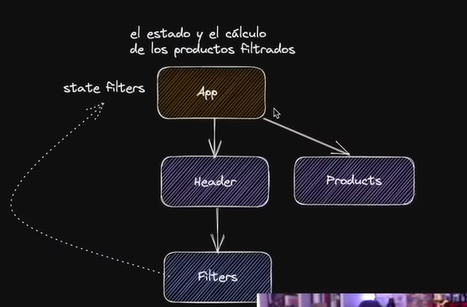

# Filtros funcionales
Qué tendríamos que hacer para que los filtros funcionen?
vámonos a la `App.jsx`...

- El `setFilters` se lo tenemos que pasar al `<Header />` porque el filtrado de productos lo tenemos a nivel de la App



- La App es la que tiene el estado y el cálculo de los productos filtrados
- Tiene el estado de filtros
- Cuando se vaya bajando hacia los componentes, la `App` tiene dos hijos renderizando que son `Header` y `Products`, mientras que `Products` no tiene más hijos, pero `Header` sí, que es `Filters` es el que lee y actualiza el estado de los filtros
- Por eso tenemos que pasar el `setFilter` de la App al `Header` y del `Header` al `Filter`, eso es drop drilling.

desde la App al Header:
```js
return (
    <>
      <Header changeFilters={ setFilters } />
      <Products products={ filteredProducts } />
    </>
  );
```
Del Header al Filter:
```js
import { Filters } from './Filters.jsx';

export function Header ({ changeFilters }) {
    return(
        <header>
            <h1>React Shop</h1>
            <Filters onChange={ changeFilters } />
        </header>
    )
}
```

y le ponemos un `onChange` a la función Filters dentro de `Filters.jsx`, asimismo modificamos handles
```js
import { useState } from 'react';
import './Filters.css';

export function Filters ({ onChange }) {
    const  [minPrice, setMinPrice] = useState(0);
    
    const handleChangePrice = (event) => {
        setMinPrice(event.target.value);
        /**lo llamamos tanto por si cambiamos el precio,
         *  obtener el estado previo, y el nuevo estado */
        //Esto funciona, pero no está bien!!!!!!!!
        //Aquí hay dos fuentes de la verdad, es un problema realmente, luego lo arreglamos
        onChange(prevState => ({
            ...prevState,
            minPrice: event.target.value
        }))
    }

    //hacemos un handle para categoría
    //Pero esto está mal, porque 
    //estamos pasando la función de actualizar estado
    //nativa de React a un componente hijo
    const handleChangeCategory = (event) =>{
        onChange(prevState => ({
            ...prevState,
            category: event.target.value
        }))
    }
    //y lo colocamos en el Select

    return(
        <section className="filters">
            <div>
                <label htmlFor="price">Precio desde:</label>
                <input 
                    type="range"
                    id="price"
                    min='0'
                    max='1000' 
                    onChange={ handleChangePrice }
                />
                <span>${ minPrice }</span>
            </div>

            <div>
                <label htmlFor="category">Categoría</label>
                <select name="category" id="category" onChange={ handleChangeCategory }>
                    <option value="all">Todas</option>
                    <option value="laptops">Laptops</option>
                    <option value="smartphones">Celulares</option>
                </select>
            </div>
        </section>
    )
}
```

- Por ahora tenemos un filtrado sencillo, no debemos utilizar `useMemo` ni `useCalback` porque tienen un coste mayor

> Sucede que hasta ahorita hay algo malo, hay un error de bulto, que se comete muchas veces

- Lo más difícil de React es usar bien React.

Tenemos que saber que el contraro que espera el onChange es el del state (estado), necesitamos algo más concreto

Sí funciona todo, pero luego arreglaremos esto...
