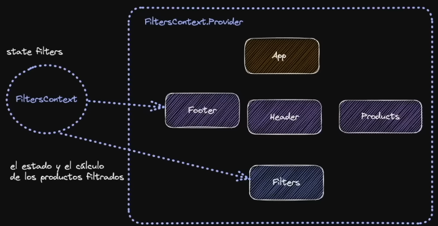
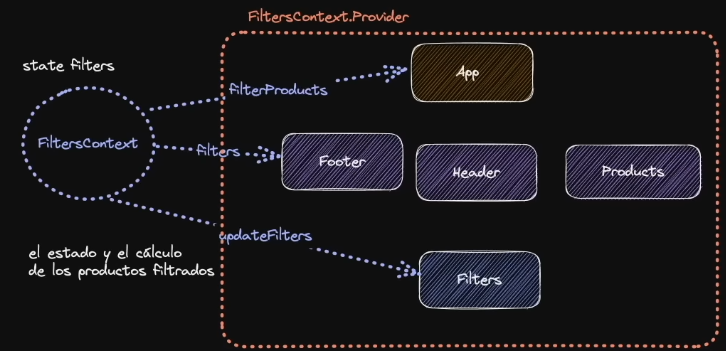

# useContext, crear contextos en React, y para qué sirve
Este nos va a permitir tener un contexto
- Primero, haremos un custom Hook, porque en `App.jsx` tenemos estados 
- Separaremos en hooks la lógica de los filtros, porque los podríamos reutilizar en otro componente

```js
import { useState } from "react";
import { Products } from "./components/Products";
import { products as initialProducts } from "./mocks/products.json";
import { Header } from "./components/Header";

//creamos un custom hook
function useFilters(){
  //este custon hook sólo posee la lógica de los filtros
  //se encargará de todo sobre los filtros
  const [filters, setFilters] = useState({
    category: 'all',
    minPrice: 0
  });

  const filterProducts = (products) => {
    return products.filter(product => {
      return(
        product.price >= filters.minPrice && (
          filters.category === 'all' ||
          product.category === filters.category
        )
      )
    })
  }

  return { filterProducts, setFilters }
}


function App() {
  const [products] = useState(initialProducts);//donde queramos podemos recuperar productos

  const { filterProducts, setFilters } = useFilters();

  //esta es una forma de filtrar los productos a base de los filtros y una forma de actualizar
  const filteredProducts = filterProducts(products);

  return (
    <>
      <Header changeFilters={ setFilters } />
      <Products products={ filteredProducts } />
    </>
  );
}

export default App;
```

## Arreglando prop drilling
Es probable que el tema de los filtros, lo queramos implementar en otros componentes, como por ejemplo un footer que nos diga en qué filtro estamos, o qué filtros tenemos activos.

- Creamos el componente `Footer.jsx`
```js
import './Footer.css'

export function Footer () {
  return (
    <footer className='footer'>
      <h4><span>Nestor Rivas</span></h4>
      <h5>Shopping Cart con useContext & useReducer</h5>
    </footer>
  )
}
```

- Importamos el footer dentro de nuestro componente `App.jsx`, y luego lo colocamos debajo de la renderización de `<Products />`
```js
    <Header changeFilters={ setFilters } />
    <Products products={ filteredProducts } />
    <Footer />
```


- El `css` para el footer sería:
```js
.footer {
  position: fixed;
  left: 16px;
  bottom: 16px;
  text-align: left;
  background: rgba(0, 0, 0, 0.7);
  padding: 8px 24px;
  border-radius: 32px;
  opacity: 0.95;
  backdrop-filter: blur(8px);
}

.footer span {
  font-size: 14px;
  color: #09f;
  opacity: 0.8;
}

.footer h4,
.footer h5 {
  margin: 0;
  display: flex;
}
```
## Mostrar qué filtros tenemos activados
- Queremos mostrar en el footer, podemos sacar los filters del `useState`
```js
import { useState } from "react";
import { Products } from "./components/Products";
import { products as initialProducts } from "./mocks/products.json";
import { Header } from "./components/Header";
import { Footer } from "./components/Footer";

function useFilters(){
  const [filters, setFilters] = useState({
    category: 'all',
    minPrice: 0
  });

  const filterProducts = (products) => {
    return products.filter(product => {
      return(
        product.price >= filters.minPrice && (
          filters.category === 'all' ||
          product.category === filters.category
        )
      )
    })
  }

  //sacamos los filters
  return { filters, filterProducts, setFilters }

}


function App() {
  const [products] = useState(initialProducts);

  //sacamos filters
  const { filters, filterProducts, setFilters } = useFilters();
  //y pasamos filters como props al footer

  const filteredProducts = filterProducts(products);

  return (
    <>
      <Header changeFilters={ setFilters } />
      <Products products={ filteredProducts } />
      <Footer filters={ filters } />
    </>
  );
}

export default App;
```

- Ahora el `Footer` recibirá unas modificaciones
```js
import './Footer.css'

//pasamos filters como props
//se puede construir una especie de Debugger
export function Footer ({ filters }) {
  return (
    <footer className='footer'>
      {
        JSON.stringify(filters, null, 2)
      }

      {/* <h4><span>Nestor Rivas</span></h4>
      <h5>Shopping Cart con useContext & useReducer</h5> */}
    </footer>
  )
}
```

Esto nos puede servir para cuando queramos implementar una especie de Debugger de estado en nuestra aplicación mientras estamos en Desarrollo, para poder visualizar qué es lo que sale por si tenemos problemas.
- Esta es una forma de verificar rápidamente el estado de nuestros filtros. Que es algo super útil. 
- De hecho, esto lo podríamos poner en modo "Desarrollo"
- Hágamos una configuración, nos dirigimos a la carpeta de `src` y creamos el archivo `config.js`
```js
export const IS_DEVELOPMENT = process.env.NODE_ENV != 'production';
//IS_DEV va a ser true si proccess dev es diferente de 'producción'
//esto puede evitar problemas de qué es lo que pasa, por qué los estados no se ven
//sin necesidad de abrir las herramientas de desarrollo del navegador
//cuando se empaqueta para producción, el NODE_ENV cambia automáticamente a modo production
```

Modificamos en `App.jsx`
```js
<Header changeFilters={ setFilters } />
<Products products={ filteredProducts } />
{IS_DEVELOPMENT && <Footer filters={ filters } />}
```

## Limpiar App.jsx
Tenemos nuestro componente `App.jsx` un poco sucio, por tanto filtro que le estamos pasando y tanto código que tenemos, porque el componente App se encarga de cómo tiene que pasar toda esa información.

Sería interesante que sólo los componentes que necesitan ese filtro pudiesen acceder ese filtro

> Para eso, utilizaremos el concepto del CONTEXTO

https://react.dev/learn/passing-data-deeply-with-context

Tenemos que desacoplar toda la lógica de los filtros en una parte totalmente separada y además cualquiera que lo necesite pueda leerlo sin necesidad de pasarselo, y evitar el prop drilling
El contexto está totalmente separado de nuestro árbol de componentes y que pueden leer de forma separada
Pero cómo saber el filter que pueden leer desde los componentes separados? pues envolviendo los componentes en un proveedor.



Tres pasos:
1. Crear el Contexto
2. Proveer el Contexto
3. Consumir el contexto

## 1. Crear el Contexto
- Nos dirigimos a la carpeta `src` y creamos una carpeta llamada `context` y creamos dentro de esa carpeta un `filters.jsx`

```jsx
import { createContext } from "react";

//1. Crear el contexto
export const FiltersContext = createContext();

//2. Proveer el contexto
//el provider tendrá información a la que queremos acceder, no tiene porqué ser un estado o tener un tipo de lógica
//podría incluso ser un número.
export function FiltersProvider({ children }) {
  return (
    <FiltersContext.Provider
      value={{
        category: "all",
        minPrice: 0,
      }}
    >
      {children}
    </FiltersContext.Provider>
  );
}
```
¿Dónde tenemos que utilizar el filter provider?
pues depende, por ejemplo, si queremos acceder info de los filtros, vamos a querer acceder a nivel de la app, sacando diferente información para cada uno, pero todos necesitan acceso



## 2. Cómo Proveer el Contexto?
Pues, nos vamos al `main.jsx` y donde renderizamos App en el modo estricto, quitamos eso y a cambio colocamos el proveedor y ya estamos envolviendo nuestra aplicación
```jsx
import React from 'react'
import ReactDOM from 'react-dom/client'
import App from './App.jsx'
import './index.css'
import { FiltersProvider } from './context/filters.jsx'


ReactDOM.createRoot(document.getElementById('root')).render(
  <FiltersProvider>
    <App />
  </FiltersProvider>,
)
```
Aún falta que consumirlo...

## 3. Consumir el contexto
Nos dirigimos hacia `App.jsx`, sacamos lo que teníamos en el useState, sacamos los filters...
```jsx
import { useContext, useState } from "react";
import { Products } from "./components/Products";
import { products as initialProducts } from "./mocks/products.json";
import { Header } from "./components/Header";
import { Footer } from "./components/Footer";
import { IS_DEVELOPMENT } from './config.js';
import { FiltersContext } from "./context/filters.jsx";

function useFilters(){
  // const [filters, setFilters] = useState({
  //   category: 'all',
  //   minPrice: 0
  // });

  const filters = useContext(FiltersContext);//sacamos los filters del contexto que queremos utilizar
  
  console.log(filters)//podemos ver que consumimos un contexto estático
  const setFilters = () => {}

  const filterProducts = (products) => {
    return products.filter(product => {
      return(
        product.price >= filters.minPrice && (
          filters.category === 'all' ||
          product.category === filters.category
        )
      )
    })
  }

  return { filters, filterProducts, setFilters }

}


function App() {
  const [products] = useState(initialProducts);

  const { filters, filterProducts, setFilters } = useFilters();

  const filteredProducts = filterProducts(products);

  return (
    <>
      <Header changeFilters={ setFilters } />
      <Products products={ filteredProducts } />
      {IS_DEVELOPMENT && <Footer filters={ filters } />}
    </>
  );
}

export default App;

```

de dónde sacamos FiltersContext? pues, de nuestro proveedor.
```jsx
import { createContext } from "react";

//este es el contexto que tenemos que consumir
export const FiltersContext = createContext();

//nos provee de acceso al contexto
export function FiltersProvider({ children }) {
  return (
    <FiltersContext.Provider
      value={{
        category: "all",
        minPrice: 0,
      }}
    >
      {children}
    </FiltersContext.Provider>
  );
}
```
Con esto ya tendríamos acceso al contexto de FiltersContext. pero... ha dejado de funcionar, porque no estamos pasando nada en el setFilters
Podemos devolver un `console.log(filters)` para ver qué pasa.

podemos ver que consumimos un contexto estático, no está mal, puede existir un contexto estático, por ejemplo tener un contexto para los colores del tema (theming) o algo para inyectar configuración. No pasa nada, muchas veces se cree que el contexto siempre tenemos que utilizarlo para darnos un estado global, no, no siempre.

El contexto, es una forma de inyeción de dependencias: puedes inyectar información, saltándote las props de los componentes.
El hecho que podamos hacer un estado global de esto, es algo circunstancial de lo que nos permite hacer, pero perfectamente podemos enviar información estática, puede ser configuraciones, puede ser traducciones, tokens, colores de variables del tema, no es sólo para hacer estados globales.

Se puede hacer estados globales? sí, pero no sólo es para eso.

## Hacer que nuestro contexto tenga un estado
Nos vamos para nuestro archivo `filters.jsx` e importamos el useState, y en el proveedor vamos a crear el estado
```jsx
import { createContext, useState } from "react";

export const FiltersContext = createContext();

export function FiltersProvider({ children }) {
  //en el contexto controlamos esto, porque está fuera del componente, y su estado se comparte
  //así es como tendremos el estado global.
  const [filters, setFilters] = useState({
    category: 'all',
    minPrice: 0
  })

  return (
    <FiltersContext.Provider
      value={{
        filters,
        setFilters
      }}
    >
      {children}
    </FiltersContext.Provider>
  );
}
```

Luego modificamos en `App.jsx`
```jsx
import { useContext, useState } from "react";
import { Products } from "./components/Products";
import { products as initialProducts } from "./mocks/products.json";
import { Header } from "./components/Header";
import { Footer } from "./components/Footer";
import { IS_DEVELOPMENT } from './config.js';
import { FiltersContext } from "./context/filters.jsx";

//filters.jsx nos devuelve el filters y setFilters
function useFilters(){
  //destructuring
  const { filters, setFilters } = useContext(FiltersContext);

  const filterProducts = (products) => {
    return products.filter(product => {
      return(
        product.price >= filters.minPrice && (
          filters.category === 'all' ||
          product.category === filters.category
        )
      )
    })
  }

  return { filters, filterProducts, setFilters }

}


function App() {
  const [products] = useState(initialProducts);

  const { filters, filterProducts, setFilters } = useFilters();

  const filteredProducts = filterProducts(products);

  return (
    <>
      <Header changeFilters={ setFilters } />
      <Products products={ filteredProducts } />
      {IS_DEVELOPMENT && <Footer filters={ filters } />}
    </>
  );
}

export default App;
```

y esto, ya debería funcionar!!!
por ahora funciona.

Es súper importante muchas veces hacer los cambios iterativos
ahora podemos ver que con los pocos cambios que hemos hecho, ya tenemos un estado global en nuestro componente. Esto renderiza los componentes que están dentro del proveedor.

# cuándo usar useContext?
useContext, como estado global está pensado para estados muy pequeños, para estados que cambien con poca frecuencia. Ej: que el usuario tenga la sesión abierta, no sucede tanto, no sucede que cierra y abre sesión a cada rato.

aquí con todo lo que hemos hecho, hemos generado un estado global, pero aún así todavía no estamos haciendo bien esto, seguimos haciendo prop drilling, pero lo bueno es que ahora gracias a lo que hemos hecho con useFilters podemos evitar el prop drilling

# Crear una carpeta de hooks
Vamos a crear una carpeta donde almacenaremos los hooks, esta estará en `src` a nivel de `components`, `mocks` 
- Creamos un archivo dentro de esa carpeta `hooks` llamado `useFilters.jsx`

Una de las ventajas de esto, es que estamos haciendo que nuestros componentes tengan una menor carga de lógica, posible, y simplificando al máximo, lo que están renderizando.

código quedaría así:
```jsx
import { useContext } from "react";
import { FiltersContext } from "../context/filters";


export function useFilters(){

    const { filters, setFilters } = useContext(FiltersContext);
  
    const filterProducts = (products) => {
      return products.filter(product => {
        return(
          product.price >= filters.minPrice && (
            filters.category === 'all' ||
            product.category === filters.category
          )
        )
      })
    }
  
    return { filters, filterProducts, setFilters }
  
  }
```

Ahora el código de `App.jsx`quedaría así:
```jsx
import { useState } from "react";
import { Products } from "./components/Products";
import { products as initialProducts } from "./mocks/products.json";
import { Header } from "./components/Header";
import { Footer } from "./components/Footer";
import { IS_DEVELOPMENT } from './config.js';
import { useFilters } from "./hooks/useFilters.jsx";

function App() {
  const [products] = useState(initialProducts);

  const { filters, filterProducts, setFilters } = useFilters();//esto es lo unico que será que necesite nuestra app

  const filteredProducts = filterProducts(products);

  return (
    <>
      <Header changeFilters={ setFilters } />
      <Products products={ filteredProducts } />
      {IS_DEVELOPMENT && <Footer filters={ filters } />}
    </>
  );
}

export default App;

```

y podemos seguir modificando para evitar el prop drilling

- Empecemos por el `<Header />` en este estamos trayendo el `setFilters` para pasarselo como prop, se lo vamos a quitar. 

```jsx
import { useState } from "react";
import { Products } from "./components/Products";
import { products as initialProducts } from "./mocks/products.json";
import { Header } from "./components/Header";
import { Footer } from "./components/Footer";
import { IS_DEVELOPMENT } from './config.js';
import { useFilters } from "./hooks/useFilters.jsx";

function App() {
  const [products] = useState(initialProducts);

  const { filters, filterProducts, setFilters } = useFilters();//esto es lo unico que será que necesite nuestra app

  const filteredProducts = filterProducts(products);

  return (
    <>
      <Header />
      <Products products={ filteredProducts } />
      {IS_DEVELOPMENT && <Footer filters={ filters } />}
    </>
  );
}

export default App;
```

- Luego dentro de `Header.jsx` vamos a quitar el changeFilter y vamos a dejar que simplemente renderice el `<Filter />`

```jsx
import { Filters } from './Filters.jsx';

export function Header () {
    return(
        <header>
            <h1>React Shop</h1>
            <Filters />
        </header>
    )
}
```

- Luego, nos dirigimos al `Filter.jsx` y le vamos a quitar el `onChange`

```jsx
import { useState } from "react";
import { Products } from "./components/Products";
import { products as initialProducts } from "./mocks/products.json";
import { Header } from "./components/Header";
import { Footer } from "./components/Footer";
import { IS_DEVELOPMENT } from './config.js';
import { useFilters } from "./hooks/useFilters.jsx";

function App() {
  const [products] = useState(initialProducts);

  const { filters, filterProducts, setFilters } = useFilters();
  //esto es lo unico que será que necesite nuestra app, setFilters

  const filteredProducts = filterProducts(products);

  return (
    <>
      <Header />
      <Products products={ filteredProducts } />
      {IS_DEVELOPMENT && <Footer filters={ filters } />}
    </>
  );
}

export default App;
```

- Ahora vamos a `Filters.jsx` y modificamos
```jsx
import { useState, useId } from 'react';
import './Filters.css';
import { useFilters } from '../hooks/useFilters';

export function Filters () {
    const { setFilters } = useFilters();//cada vez que queramos cambiar el estado

    const  [minPrice, setMinPrice] = useState(0);
 
    const minPriceFilterId = useId();
    const categoryFilterId = useId();
    
    const handleChangePrice = (event) => {
        setMinPrice(event.target.value);
        setFilters(prevState => ({
            ...prevState,
            minPrice: event.target.value
        }))
    }

    const handleChangeCategory = (event) =>{
        setFilters(prevState => ({
            ...prevState,
            category: event.target.value
        }))
    }
    //y lo colocamos en el Select

    return(
        <section className="filters">
            <div>
                <label htmlFor={ minPriceFilterId }>Precio desde:</label>
                <input 
                    type="range"
                    id={ minPriceFilterId }
                    min='0'
                    max='1000' 
                    onChange={ handleChangePrice }
                />
                <span>${ minPrice }</span>
            </div>

            <div>
                <label htmlFor={ categoryFilterId }>Categoría</label>
                <select name="category" id={ categoryFilterId } onChange={ handleChangeCategory }>
                    <option value="all">Todas</option>
                    <option value="laptops">Laptops</option>
                    <option value="smartphones">Celulares</option>
                </select>
            </div>
        </section>
    )
}
```

- Listo, ahora ya no necesito tener el `setFilter` de aquí `const { filters, filterProducts, setFilters } = useFilters();` en nuestra `App.jsx` procedemos a quitarlo

Y con esto qué hemos hecho?
- en el `<Header />` de `App.jsx` hemos quitado la props que se le pasaba, en el `useFilters()` quitamos el `setFilter` en el `Header.jsx` limpiamos, y en `Filters.jsx` lo que hicimos es traer el `setFilters` directamente del estado de los filtros.

Esto está muy bien, porque nos ha simplificado la lógica del useFilters la tenemos totalmente separada de los propios filters.

Esto funciona perfectamente, eliminamos todo el prop drilling, haciendo el estado global.

> Errores que se comenten en React: es el tema de tener dos fuentes de la verdad... que veremos en el otro capítulo...